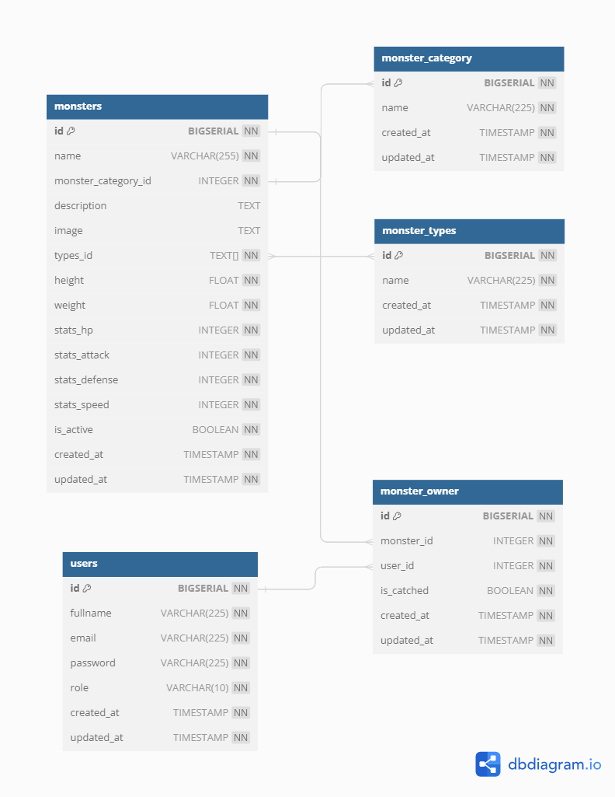
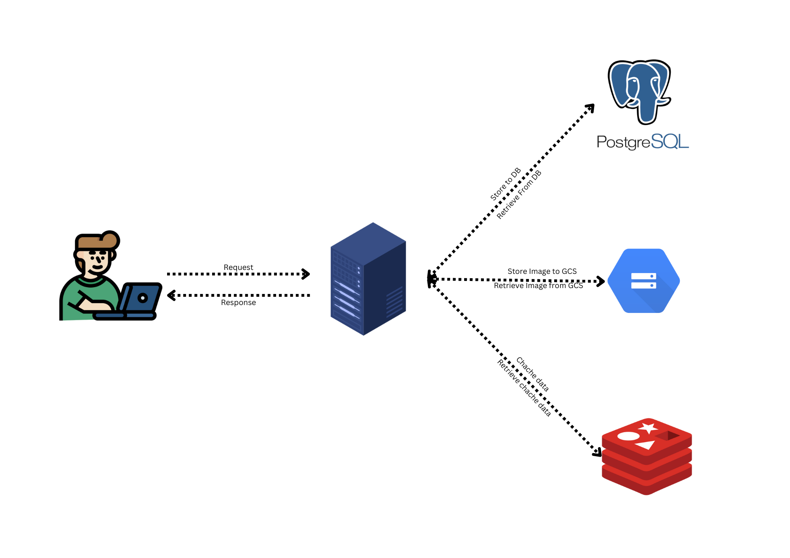

# Go Monstérdex
The Go Monstérdex App is a simple yet comprehensive application that serves as a digital encyclopedia for Monstér enthusiasts. It provides information about various Monstér species, their abilities, types, moves, and other relevant details.

## App Features
- User Authentication: Create an account or log in securely.
- Token-Based Authentication: Secure API endpoints.
- Monstér Database: Access detailed information about hundreds of Monstér species.
- Search Functionality: Search for Monstér by name, type, or other attributes.
- Catch & Release: User can catch monster and release.

## Tech Specifications
### Stack
- **Golang**(Echo)
- **PostgreSQL**
- **Redis**
- **GCS**(Storage)

### Architecture
The project follows a clean architecture pattern, separating concerns into different layers:

- **Handler Layer**: This layer is responsible for handling incoming requests.
- **Service Layer**: Contains the business logic.
- **Repository Layer**: Deals with data storage and retrieval data from DB.

## Documentation
### API Specification
[API Specification](http://35.188.107.108:3000/swagger/index.html)

### Database Schema


### Postman
[API Specification](https://documenter.getpostman.com/view/28576845/2s9YeK4Vfp)

### System Design


## Quick Start
### Clone App
```
git clone https://github.com/DitoAdriel99/go-monsterdex.git
```
### Set ENV
Change .env.example to .env

### Running App
if use docker
```
docker compose up -d
```
if use Makefile
```
make start
```

### Runnnig Unit Test
*note: app must be running first
if use Makefile
```
make test
```
### Link Demo
```
http://35.188.107.108:3000/
```